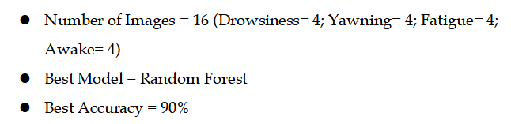
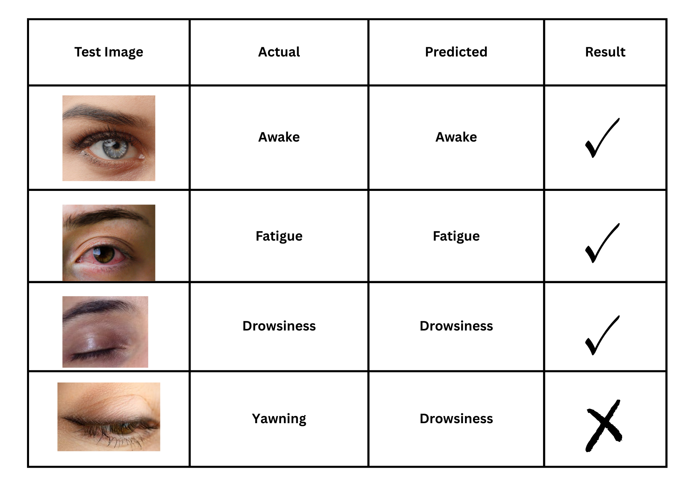
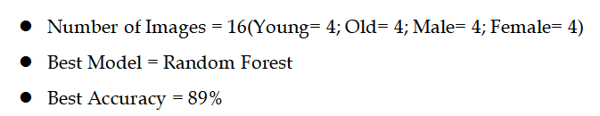
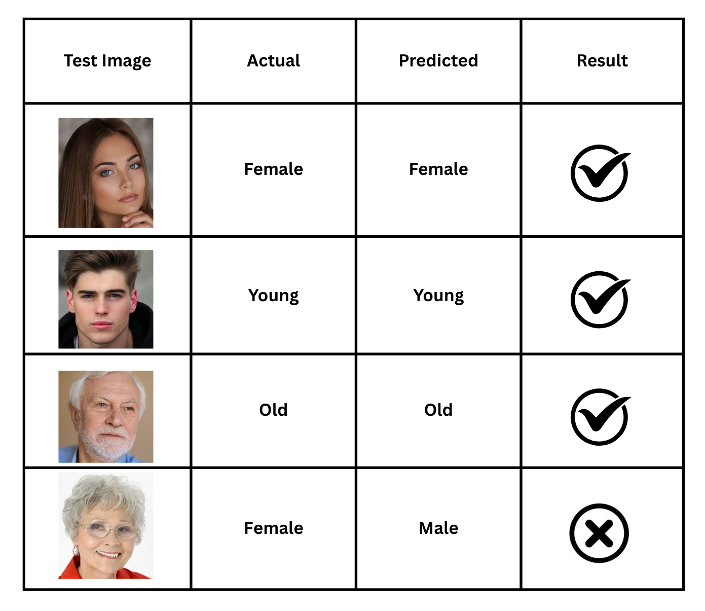

# Essentials-of-AI
Two AI models using Landing AI: one for drowsiness detection and another for age group and gender classification.

## 📌 Models Included
## Model 1. 👁️ Eye-Based Drowsiness Detection
## 1. Methodology ##

## 2. Description ##

## 3. Input / Output ##

## Model 2. 🧑‍🦰 Age Group & Gender Classification
## **1. Methodology**

## **2. Description**

## **3. Input / Output**

