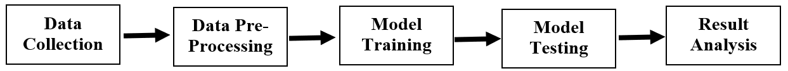

# Essentials-of-AI
Two AI models using Landing AI: one for drowsiness detection and another for age group and gender classification.

## 📌 Models Included
## Model 1. 👁️ Eye-Based Drowsiness Detection
## 1. Methodology ##

## 2. Description ##
Objective: Detect eye states such as awake, fatigued, yawning, and drowsy using deep learning.

Use Case: Enhancing safety in transportation, manufacturing, healthcare, and exam monitoring.

Highlights:

i. Real-time classification with predicted vs actual output

ii. 90% model accuracy

iii. Confusion matrix with 15 correct and 1 misclassified sample

iv. QR-based image upload workflow

## 2. 🧑‍🦰 Age Group & Gender Classification
Objective: Classify individuals into age groups and identify gender from facial images.

Use Case: Advertising, digital verification, crowd analytics, and personalized services.

Highlights:

i. 89% model accuracy

ii. Confusion matrix with 14 correct and 2 misclassified samples

iii. Real-time classification with predicted vs actual output

iv. QR-based image upload workflow

